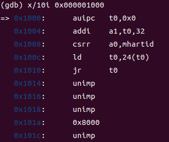
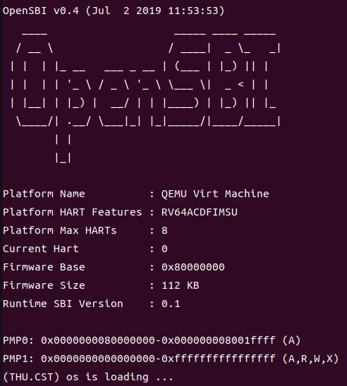
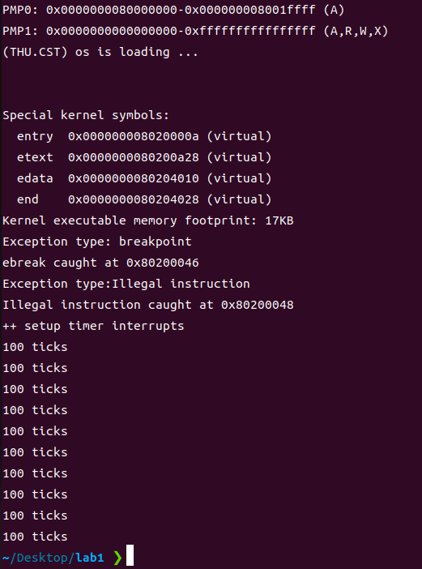
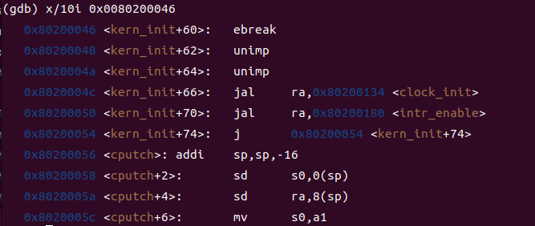

# lab0.5-1 代码及运行结果

## lab0.5 gdb结果


## lab0.5 qemu结果


## lab1代码

init.c:kern_init
```cpp {.line-numbers}
idt_init();

//add code here
asm volatile("ebreak");//breakpoint
asm volatile(".word 0x00000000");//illegal
    
clock_init();
```
trap.c:interrupt_handler
```cpp {.line-numbers}
case IRQ_S_TIMER:
    clock_set_next_event();
    ticks++;
    if(ticks==100){
        print_ticks(); //cprintf("100 ticks\n");
        ticks=0;
        num++;
        if(num==10)
            sbi_shutdown();
    }
    break;
```

trap.c:exception_handler
```cpp {.line-numbers}
case CAUSE_ILLEGAL_INSTRUCTION:
    cprintf("Exception type:Illegal instruction\n");
    cprintf("Illegal instruction caught at 0x%08x\n", tf->epc);
    tf->epc+=4;
    break;
case CAUSE_BREAKPOINT:
    cprintf("Exception type: breakpoint\n");
    cprintf("ebreak caught at 0x%08x\n", tf->epc);
    tf->epc+=2;
    break;
```
## lab1运行结果


## 遇到的问题与解决

在lab1 添加断点过程中，一开始发现找到两个中断后没有进行后面的timer interrupt。

后来通过gdb发现断电指令长度为2字节，对其进行调整后通过。

