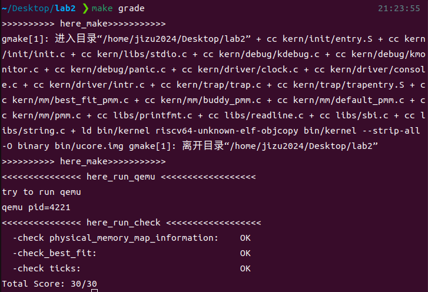

# lab2 操作系统实验报告

### 姚知言 2211290 贾景顺 2211312 李政远 2211320


### Exercise1：理解first-fit 连续物理内存分配算法

>first-fit 连续物理内存分配算法作为物理内存分配一个很基础的方法，需要同学们理解它的实现过程。请大家仔细阅读实验手册的教程并结合kern/mm/default_pmm.c中的相关代码，认真分析default_init，default_init_memmap，default_alloc_pages， default_free_pages等相关函数，并描述程序在进行物理内存分配的过程以及各个函数的作用。 请在实验报告中简要说明你的设计实现过程。请回答如下问题：  
你的first fit算法是否有进一步的改进空间？    

#### 虚拟内存的构建

当操作系统完成加电以及进入内核后，通过修改内核代码的链接地址并构建合适的页表项（减去虚拟地址和物理地址间的偏移量`0xffffffff40000000`），随后令页基址寄存器指向页表基质并刷新TLB（因为改变`satp`的同时也改变了映射方式），这样就成功构建了虚拟内存及其分页机制。
#### 内存分配初始化
进一步地，需要探究在这样的机制下是如何进行物理内存的管理与分配的。首先在`kern_init`中通过对于`pmm_init`的调用，在其内部调用了`init_pmm_manager`实现了对`pmm_manager`结构体的初始化，即选择管理页面算法并初始化对应的参数；随后在`page_init`中，实现可用页面起始地址与数量的计算与分配，并在`init_memmap`进行更加详细的初始化。
在经过上述一系列流程，程序成功完成了对物理内存分配模式的选择及初始化，当程序需要内核占据以外的物理地址时，能够按照所选择的结构体进行正确分配或引发异常。

#### First-Fit内存分配算法
在物理内存管理中，first-fit算法是一种简单且有效的内存分配策略。它通过遍历空闲内存块，找到第一个满足请求大小的块并进行分配。下面将分别阐述`default_init`、`default_init_memmap`、`default_alloc_pages` 和 `default_free_pages’`函数的作用。

- default_init
调用 `list_init(&free_list) `初始化空闲页面链表，并将可用页面计数 `nr_free `设为0。确保系统开始时没有可用的物理页面，实现了内存管理方法的初始化。

- default_init_memmap
该函数通过参数中给出的页块头*base和n，用于初始化从base开始向后数n个页的页块，并将其插入到空闲链表中。
具体实现了遍历给定的页面范围，检查每个页面是否被保留，清除其标志和属性，并将引用计数设置为0；设置基础页面的属性（property）为传入的页面数量，并将其标记为已分配；更新可用页面计数并根据页面的地址插入到空闲页面链表中，保持有序性。
初始化步骤为从freelist头开始，不断向后遍历，如果freelist是空的则直接将base加入，如果不为空，则将base与freelist中页面块对比，如果base小于页面块page，则直接加入，如果到最后也没有合适的page，则加入到尾部。

- default_alloc_pages
在给定需求下找到空闲链表中第一个符合要求的空闲页块，具体实现流程如下：
首先进行需求是否大于0以及是否大于当前所有空闲页数量的判定，若数据在范围之内，将遍历空闲链表直到搜索到第一个空闲页面数大于等于需求的页块，并将需要的页面数分配出去。随后对链表进行更新，具体表现为断开当前页块与前节点的连接，更新其空闲页块数’property’，并将更新后的节点重新连接。

- default_free_pages
在指定的页面处释放给定数量的空间，先以基址为起点遍历将页表的`flag`位置0表示未分配，并更改基址的`property`的值以及可分配页面数；随后利用双向链表的前后节点合并相邻的空闲页面，以减少内存碎片。

#### First-Fit内存分配算法的改进
1.	first fit算法会产生大量小的碎片内存块,浪费空间。可以设定一个固定周期合并可以合并的内存碎片，例如进行100次内存分配就遍历进行合并一次，将其合并到相邻的空闲内存块中，减少碎片；或采取懒惰合并，仅在需要分配空间的时候进行合并。
2.	使用多个空闲块链表来管理不同大小范围的空闲块。根据空闲块的大小将它们分别放入对应的链表中，在分配时可优先从大小适配的链表中查找空闲块，减少在整个空闲块链表中搜索的时间。

### Exercise2：实现 best-fit 连续物理内存分配算法

>在完成练习一后，参考kern/mm/default_pmm.c对First Fit算法的实现，编程实现Best Fit页面分配算法，算法的时空复杂度不做要求，能通过测试即可。 请在实验报告中简要说明你的设计实现过程，阐述代码是如何对物理内存进行分配和释放，并回答如下问题：
你的 Best-Fit 算法是否有进一步的改进空间？

#### 编程实现

在best_fit_pmm.c中，进行以下补充。

为解决重定义问题，需要将free_area声明为extern。

```cpp {.line-numbers}
extern free_area_t free_area;
```

best_fit_init_memmap函数(1)
```cpp {.line-numbers}
for (; p != base + n; p ++) {
    assert(PageReserved(p));
        
    // 清空当前页框的标志和属性信息，并将页框的引用计数设置为0

    p->property = 0; //清空属性信息
    p->flags = 0;//清空标志
    set_page_ref(p, 0);//引用计数设置为0
}
```
在初始化函数的开始，需要清空页框的标志和属性信息，并且将页框的引用次数清零。

best_fit_init_memmap函数(2)
```cpp {.line-numbers}
 while ((le = list_next(le)) != &free_list) {
    struct Page* page = le2page(le, page_link);

    // 编写代码
    // 1、当base < page时，找到第一个大于base的页，将base插入到它前面，并退出循环
    // 2、当list_next(le) == &free_list时，若已经到达链表结尾，将base插入到链表尾部
    if (base < page) {
        list_add_before(le, &(base->page_link));
        break;
    } 
    else if (list_next(le) == &free_list) {
        list_add(le, &(base->page_link));
        }
    }
```
free_list非空的分支，通过if语句找到第一个大于base的页，将base插入。或者当到链表结尾也没能找到，则插入链表尾部。

best_fit_alloc_page函数
```cpp {.line-numbers}
// 下面的代码是first-fit的部分代码，请修改下面的代码改为best-fit
// 遍历空闲链表，查找满足需求的空闲页框
// 如果找到满足需求的页面，记录该页面以及当前找到的最小连续空闲页框数量
while ((le = list_next(le)) != &free_list) {
    struct Page *p = le2page(le, page_link);
    if (p->property >= n && (page == NULL || p->property < page->property)) {
        page = p;
    }
}
```
把first-fit逻辑替换为best-fit。while语句的含义是对链表的遍历。其中，若找到了一个大于base的页：
若之前没有找到其他满足要求的页，则更新要分配的页为该页。
否则，将其与之前找到的页相比较，分配更小的空闲页。

best_fit_free_page函数(1)
```cpp {.line-numbers}
// 编写代码
// 具体来说就是设置当前页块的属性为释放的页块数、并将当前页块标记为已分配状态、最后增加nr_free的值
base->property = n; //设置页块属性
SetPageProperty(base);
nr_free = nr_free + n; //增加空闲页数量
```
定义了新page*变量base，在这一部分对base完成要释放的空闲页的赋值，并且更新空闲页数量。

best_fit_free_page函数(2)
```cpp {.line-numbers}
// 编写代码
// 1、判断前面的空闲页块是否与当前页块是连续的，如果是连续的，则将当前页块合并到前面的空闲页块中
// 2、首先更新前一个空闲页块的大小，加上当前页块的大小
// 3、清除当前页块的属性标记，表示不再是空闲页块
// 4、从链表中删除当前页块
// 5、将指针指向前一个空闲页块，以便继续检查合并后的连续空闲页块
if (p + p->property == base) {
    p->property = p->property + base->property;
    ClearPageProperty(base);
    list_del(&(base->page_link));
    base = p;
}
```
在空闲链表非空的情况下，判断前面的空闲页块是否与当前的空闲页块是连续的，若连续，则将两个空闲页块合并（即删除之前的并且更新base）。

#### 测试结果

通过make grade获取成绩。成功通过了所有check要求，得分30/30。



#### 改进空间

1.  与first-fit算法相同，best-fit的同样容易产生碎片内存块，造成空间的浪费和利用率的下降。
2.  当前best-fit算法需要遍历所有空闲块，才能完成一次分配。可以设置排序算法和二分算法，使用快慢指针，为不同大小空闲块使用不同链表管理等方式加快块的查找效率。

### Challenge1：buddy system（伙伴系统）分配算法

>Buddy System算法把系统中的可用存储空间划分为存储块(Block)来进行管理, 每个存储块的大小必须是2的n次幂(Pow(2, n)), 即1, 2, 4, 8, 16, 32, 64, 128...
参考伙伴分配器的一个极简实现， 在ucore中实现buddy system分配算法，要求有比较充分的测试用例说明实现的正确性，需要有设计文档。

该部分的设计文档单独建立了markdown文件，请参阅$lab2\_buddy.md$。

### Challenge2：任意大小的内存单元slub分配算法

>slub算法，实现两层架构的高效内存单元分配，第一层是基于页大小的内存分配，第二层是在第一层基础上实现基于任意大小的内存分配。可简化实现，能够体现其主体思想即可。
参考linux的slub分配算法，在ucore中实现slub分配算法。要求有比较充分的测试用例说明实现的正确性，需要有设计文档。

### Challenge3：硬件的可用物理内存范围的获取方法

>如果 OS 无法提前知道当前硬件的可用物理内存范围，请问你有何办法让 OS 获取可用物理内存范围？
1.  BIOS/UEFI 查询.在开机自检（POST）阶段，BIOS 或 UEFI 固件会识别系统中的硬件组件，包括内存。操作系统在启动时，会通过特定的接口调用这些固件提供的服务，获取内存信息。在现代系统中，ACPI（高级配置和电源接口）是一个关键的组成部分，它不仅提供了硬件的配置信息，还可以报告可用内存的具体范围。操作系统会解析 ACPI 表，获取有关内存的地址范围、大小以及保留内存和可用内存的具体信息。这一过程通常是自动进行的，确保操作系统能够正确地了解可用的物理内存区域，以便进行有效的内存管理。
2.  内存探测算法。当操作系统试图访问某个未被映射或不存在的内存地址时，硬件会触发异常（如页错误）。通过这种方式，操作系统可以“探测”到哪些地址是可访问的，从而推断出有效的内存范围。在系统配置不确定的情况下。它提供了一种有效的方式来发现实际的可用内存.

