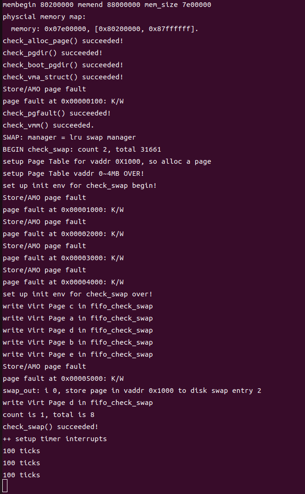

# lab3 swap-lru 设计文档

### 李政远 2211320
## 设计原理

LRU（Least Recently Used）是一种常见的页面替换算法，用于内存管理，特别是在虚拟内存系统中。当物理内存不足时，LRU算法会选择最长时间未被访问的页面进行替换，以腾出空间给新的页面。
LRU算法的核心设计原理是，优先替换在一段时间内最长时间未被访问的页面，因为我们认为最长时间未被访问的页面在未来被访问的可能性最低，因此优先替换这些页面。
整体操作思路为在每次访问新的页面的时候，重新刷新维护的链表，遍历一次页面，去寻找是否在链表中有相同的页面，如果没有则直接插入到队头，如果有则将原先的页面删除并将新的加入到队头，证明他是最新被访问的。
而自然队尾的项则为最晚被访问的页面。

## 核心设计说明：如何实现LRU页面判定
主要修改_lru_map_swappable函数，实现LRU算法。
```cpp {.line-numbers}
static int _lru_map_swappable(struct mm_struct *mm, uintptr_t addr, struct Page *page, int swap_in) {
    list_entry_t *head = (list_entry_t*) mm->sm_priv;
    list_entry_t *entry = &(page->pra_page_link);
    assert(entry != NULL && head != NULL);

    // 如果链表为空，直接将页面添加到头部
    if (list_empty(head)) {
        list_add(head, entry);
        return 0;
    }

    // 遍历链表，查找页面是否已经在链表中
    list_entry_t *curr_ptr = list_next(head); // 假设 head 是虚拟头节点，next 指向第一个实际节点
    while (curr_ptr != head) { // 遍历直到回到链表头部
        if (le2page(curr_ptr, pra_page_link) == page) {
            list_del(curr_ptr); // 删除找到的页面节点
            break; // 跳出循环
        }
        curr_ptr =  list_next(head); // 移动到下一个节点
    }
    
    // 无论页面之前是否在链表中，都将其添加到头部
    list_add(head, entry);
    return 0;
}
```
可以看出，每个有新的页面被访问时，都会遍历当前管理器中的所有⻚，并去一一对比是否有重复页面，
如果有则将其挪到队头，代表最新被访问，自然队尾的项则为最晚被访问的页面。
对于其他函数，lru_swap_out_victim 删除时则应当在尾部删除，则恰好删除了最晚被访问的页面。

#### 测试结果

通过自定义的测试案例，成功通过了assert，并且相同的案例不能在fifo通过。




