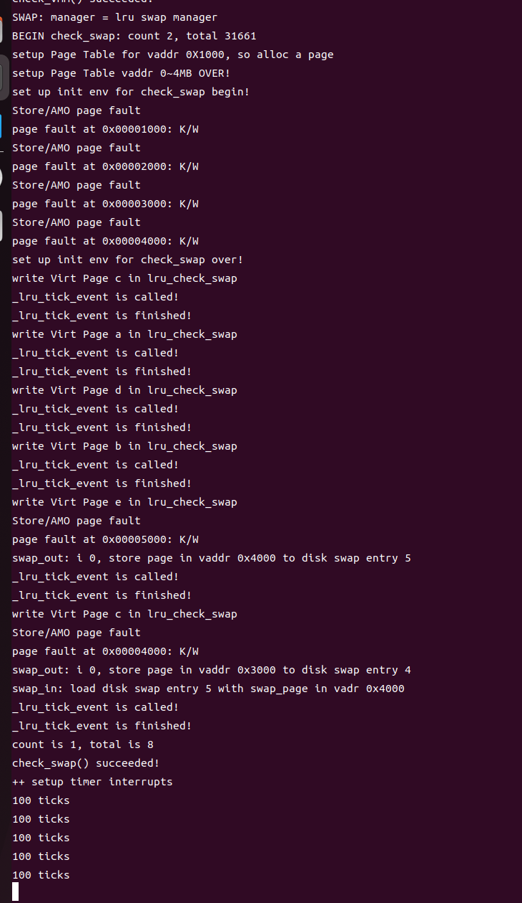

# lab3 swap-lru 设计文档

### 李政远 2211320 姚知言 2211290
## 设计原理

LRU（Least Recently Used）是一种常见的页面替换算法，用于内存管理，特别是在虚拟内存系统中。当物理内存不足时，LRU算法会选择最长时间未被访问的页面进行替换，以腾出空间给新的页面。
LRU算法的核心设计原理是，优先替换在一段时间内最长时间未被访问的页面，因为我们认为最长时间未被访问的页面在未来被访问的可能性最低，因此优先替换这些页面。
整体操作思路为在基于时钟中断，在每次中断的时候重新刷新维护的链表，去遍历页表项的A位（A位为Access位，是通过硬件机制设置被访问的页表项），去发现是否被访问，如果A位为1，代表被访问则则直接插入到队头，证明他是最新被访问的。
而自然队尾的项则为最晚被访问的页面。会在产生pgfault时自然被换出。

## 核心设计说明：如何实现LRU页面判定

主要修改__lru_tick_event函数和_lru_map_swappable函数，实现LRU算法。

#_lru_map_swappable函数实现
```cpp {.line-numbers}
static int
_lru_map_swappable(struct mm_struct *mm, uintptr_t addr, struct Page *page, int swap_in)
{
    list_entry_t *head=(list_entry_t*) mm->sm_priv;
    list_entry_t *entry=&(page->pra_page_link);
 
    assert(entry != NULL && head != NULL);
    //record the page access situlation

    //(1)link the most recent arrival page at the back of the pra_list_head qeueue.
    list_add(head, entry);
    page->visited=1;
    return 0;
}
```
可以看出，在这个函数中，我采用了在ex4的clock算法的实现，通过在访问的时候手动设置当前page页表项的visit位，说明该页被访问
使其在下文的刷新中可以被发现并放置到最前端。

#_lru_tick_event函数实现
```cpp {.line-numbers}
static int
_lru_tick_event(struct mm_struct* mm)
{
    cprintf("_lru_tick_event is called!\n");
    list_entry_t* head = (list_entry_t*)mm->sm_priv;
    assert(head != NULL);
    list_entry_t* entry = list_next(head);
    while (entry != head)
    {
        struct Page* page = le2page(entry, pra_page_link);
        if (page->visited)
        {
            //cprintf("111");
            list_del(entry);
            list_add(head, entry);
            page->visited=0;
        }
        entry = list_next(entry);
    }
    cprintf("_lru_tick_event is finished!\n");
    return 0;
}
```
可以看出，每次刷新的时候，都会遍历当前的页表及其页表项，去访问页表项的visit位。如果⻚表项的visit位是1，说明⾃从上次A位被清
零后，有虚拟地址通过这个⻚表项进⾏读、或者写、或者取指，也就是说被访问，需要移⾄链表的⾸部。
对于其他函数， _lru_map_swappable 插⼊时依旧插在链表头部， _lru_swap_out_victim 删除时则应当在尾部删除。
这样，结合时钟中断的特性触发 _lru_tick_event 函数即可达到通过时钟实现的LRU⻚⾯置换算法。

#### 测试结果

## 核心测试说明：fifo和lru在结果上的不同
在初始化的环节，也就是check_content_set函数中，已经将a,b,c,d按照顺序换入了页面。
之后在check_content_access中，我们进行了按照下图所示的测试案例。
关键的一点是，由于目前该系统并没有实际上实现中断的机制，我们只能在每次进行访问的时候手动实现_lru_tick_event来实现刷新，这样也实现了基本逻辑。


#基于fifo逻辑

访问顺序为c,a,d,b,e,c
由于前四次访问是访问已经存在的页面，所以他并不会改变链表的顺序，仍然为abcd，所以在第五次访问e的时候，会产生一次缺页异常，会选择将列表第一个也就是a换出去，成为e,b,c,d。
在最后一次访问时，换c不会产生异常，因为已经存在了。
所以assert应该为num == 5，则除了初始的4次只有一次e的异常。

#基于lru逻辑

访问顺序为c,a,d,b,e,c
由于前四次访问是访问已经存在的页面，基于lru会改变链表的顺序，为cadb，所以在第五次访问e的时候，会产生一次缺页异常，会选择将列表第一个也就是c换出去，成为a,b,e,d。
在最后一次访问时，换c会产生异常，变为c,b,e,d.
所以assert应该为num == 6，则除了初始的4次和一次e的异常还有一次c的异常。

#测试结果
结果为设置assert（num == 6） 的情况下成功的通过了测试，代表采用了LRU并不是FIFO，测试成功。




