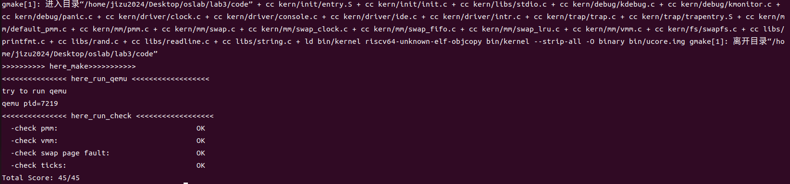

# lab3 操作系统实验报告

### 姚知言 2211290 贾景顺 2211312 李政远 2211320

### Exercise1：理解基于FIFO的页面替换算法

>描述FIFO页面置换算法下，一个页面从被换入到被换出的过程中，会经过代码里哪些函数/宏的处理（或者说，需要调用哪些函数/宏），并用简单的一两句话描述每个函数在过程中做了什么？（为了方便同学们完成练习，所以实际上我们的项目代码和实验指导的还是略有不同，例如我们将FIFO页面置换算法头文件的大部分代码放在了`kern/mm/swap_fifo.c`文件中，这点请同学们注意）
至少正确指出10个不同的函数分别做了什么？如果少于10个将酌情给分。我们认为只要函数原型不同，就算两个不同的函数。要求指出对执行过程有实际影响,删去后会导致输出结果不同的函数（例如assert）而不是cprintf这样的函数。如果你选择的函数不能完整地体现“从换入到换出”的过程，比如10个函数都是页面换入的时候调用的，或者解释功能的时候只解释了这10个函数在页面换入时的功能，那么也会扣除一定的分数。
#### 页面置换具体流程

当发生缺页错误时，系统会将错误信息传递给Page Fault传递给`kern/trap/trap.c`中的`exception_handler`进行分类并打印错误信息。随后错误信息会传递给`do_pgfault`函数尝试进行页面置换。
当进入到`do_pgfault`中时，同时会传入相对应的参数如页面结构体`mm`和发生缺页异常的地址`addr`。随后通过`find_vma`以及`get_pte`等函数，找到发生缺页异常地址对应的`vma`结构体以及页表和页表项。此时若找不到对应的页表项则会重新创建，并将其全部置0，同时会在后续分配物理页面进行映射关系的建立。
根据查找到的页表项后，会出现两种情况：
1.得到的页表项为0（无论他是新创建的还是本身存在），即该页从未被分配过物理地址。
2.得到的页表项不为0，则该页存在分配过物理地址的情况，
针对第一种情况，程序将调用`pgdir_alloc_page`函数分配新的物理页并通过`page_insert`建立新的映射。其中分配物理页的过程会通过对`alloc_page`以及`swap_out`等函数，实现对页面的换出及换入。
而在第二种情况中，先通过`swap_in`将页面内容读入并通过`page_insert`将虚拟地址和物理地址的映射关系写入到页表项中，最后通过`swap_map_swappable`以及不同的`swap_manager`结构体进行页面交换策略的选择和实现。

#### FIFO页面替换算法中具体函数的内容

上一部分主要分析了页面置换整个流程的主要工作，下面将描述在FIFO页面置换算法下，各个重要函数的基本功能。

1. `do_pgfault` 页面置换算法的主体函数，整个缺页处理流程从此开始。
2. `find vma` 在vma结构体链表中找到包含传入错误地址的vma并进行更新。
3. `get_pte` 函数会根据得到的虚拟地址，在三级页表中进行查找。在查找页表项的时候，如果页表项无效的话会给页表项分配一个全是0的页并建立映射。最后返回虚拟地址对应的一级页表的页表项。
4. `page_remove_pte` 若判定两页表项不同，则调用此函数将页表项释放。
5. `pte_create` 在`page_remove_pte`之后建立新的页表项比那个将其赋值给`get_pte`找到的页表项的地址,直接根据物理页号进行偏移并对标志位进行设置完成。
6. `pgdir_alloc_page`&`alloc_page(s)` 通过对`alloc_pages(1)`，根据FIFO算法分配一个物理页面，并进一步调用`swap_out`函数。
7. `page_insert` 完成建立虚拟地址和页面的映射关系的创建和保存，会调用的前面提及的`get_pte` 、`page_remove_pte`、`pte_create`函数
8. `swap_in` 根据页表项和地址的映射从硬盘中读取对应的内容，并重新写入内存。
9. `swap_out` 将页面换出到硬盘中。
10. `swap_map_swappable` 在FIFO算法下实例为`_fifo_map swappable`来实现页面的换入，并将其存储于FIFO的链表头。
11. `swapfs_read` 模拟从IDE设备的特定扇区读入数据。
12. `swapfs_write` 模拟从IDE设备的特定扇区写入数据。
13. `swap_out_victim` 
```cpp {.line-numbers}
static int
_fifo_swap_out_victim(struct mm_struct *mm, struct Page ** ptr_page, int in_tick)
{
     list_entry_t *head=(list_entry_t*) mm->sm_priv;
         assert(head != NULL);
     assert(in_tick==0);
     /* Select the victim */
     //(1)  unlink the  earliest arrival page in front of pra_list_head qeueue
     //(2)  set the addr of addr of this page to ptr_page
    list_entry_t* entry = list_prev(head);
    if (entry != head) {
        list_del(entry);
        *ptr_page = le2page(entry, pra_page_link);
    } else {
        *ptr_page = NULL;
    }
    return 0;
}
```
在FIFO算法下实例为`_fifo_swap_out_victim`来实现对页面的换出，即将最先进入链表的页面进行换出操作。
14. `free_page` 将被换出的物理页释放从而重新尝试分配。
15. `tlb_invalidate` 在换出流程结束后刷新TLB，防止错误发生。
### Exercise2：深入理解不同分页模式的工作原理

>get_pte()函数（位于`kern/mm/pmm.c`）用于在页表中查找或创建页表项，从而实现对指定线性地址对应的物理页的访问和映射操作。这在操作系统中的分页机制下，是实现虚拟内存与物理内存之间映射关系非常重要的内容。
get_pte()函数中有两段形式类似的代码， 结合sv32，sv39，sv48的异同，解释这两段代码为什么如此相像。
目前get_pte()函数将页表项的查找和页表项的分配合并在一个函数里，你认为这种写法好吗？有没有必要把两个功能拆开？

### Exercise3：给未被映射的地址映射上物理页

>补充完成do_pgfault（mm/vmm.c）函数，给未被映射的地址映射上物理页。设置访问权限 的时候需要参考页面所在 VMA 的权限，同时需要注意映射物理页时需要操作内存控制 结构所指定的页表，而不是内核的页表。

#### 编程实现及解释
vmm.c
```cpp {.line-numbers}
/*LAB3 EXERCISE 3: 2211290 2211312 2211320
* 请你根据以下信息提示，补充函数
* 现在我们认为pte是一个交换条目，那我们应该从磁盘加载数据并放到带有phy addr的页面，
* 并将phy addr与逻辑addr映射，触发交换管理器记录该页面的访问情况
*
*  一些有用的宏和定义，可能会对你接下来代码的编写产生帮助(显然是有帮助的)
*  宏或函数:
*    swap_in(mm, addr, &page) : 分配一个内存页，然后根据
*    PTE中的swap条目的addr，找到磁盘页的地址，将磁盘页的内容读入这个内存页
*    page_insert ： 建立一个Page的phy addr与线性addr la的映射
*    swap_map_swappable ： 设置页面可交换
*/
if (swap_init_ok) {
    struct Page *page = NULL;
    // 你要编写的内容在这里，请基于上文说明以及下文的英文注释完成代码编写
    //(1）According to the mm AND addr, try
    //to load the content of right disk page
    //into the memory which page managed.
    //(2) According to the mm,
    //addr AND page, setup the
    //map of phy addr <--->
    //logical addr
    //(3) make the page swappable.
    swap_in(mm, addr, &page);
    page_insert(mm->pgdir, page, addr, perm);
    swap_map_swappable(mm, addr, page, 1);
    page->pra_vaddr = addr;
} 
else {
    cprintf("no swap_init_ok but ptep is %x, failed\n", *ptep);
    goto failed;
}
```
`do_pgfault`的调用关系为`trap--> trap_dispatch-->pgfault_handler-->do_pgfault`，用于在遇到缺页异常的时候，实现页的替换以解决缺页问题。

该函数的主要流程为：

1. 通过`find_vma`查找该地址所在的虚拟内存，并检查虚拟内存地址是否合法，若找不到则返回错误。
2. 设置页表为用户模式，允许用户访问，同时若虚拟地址可写，则增加页表的读写权限。
3. 把地址向4K向上取整。
4. 通过`get_pte`对页表项指针进行查找，若找不到，即页表项的页表还未分配，则建立对应的页表。若`get_pte`失败，再尝试通过`pgdir_alloc_page`分配，若分配失败报错。
5. 若成功找到，则需要加载页面数据，完成页面交换。若`swap_init`未完成报错，若完成，则需要完成页面交换（本问题编程内容）。
6. 此外，该函数通过ret变量对不同错误设置不同返回值，便于判断错误情况；同时，对页错误计数器进行+1。

编程内容解释：
1. `swap_in(mm, addr, &page)`分配一个内存页，把addr对应的页面加载到物理内存，并存储到page中。
2. `page_insert(mm->pgdir, page, addr, perm)`更新页表，把物理页面和虚拟页映射起来。
3. `swap_map_swappable(mm, addr, page, 1)`设置页面的可交换状态。（在Ex4中可以得知，主要逻辑是将其链入替换链表中，并设置其访问信息等）


#### 问题解答

>请描述页目录项（Page Directory Entry）和页表项（Page Table Entry）中组成部分对ucore实现页替换算法的潜在用处。

从`memlayout.h`中可以看出，ucore中的页目录项和页表项的定义本质上都是无符号整数，同时页表项同时可以作为交换页表项。
```cpp {.line-numbers}
typedef uintptr_t pte_t;
typedef uintptr_t pde_t;
typedef pte_t swap_entry_t; //the pte can also be a swap entry
```
`mmu.h`中，有大量的宏定义，包括对pte_t各标记位的说明，以及对页表项/页目录项索引的偏移。
```cpp {.line-numbers}
#define PTE_V     0x001 // Valid
#define PTE_R     0x002 // Read
#define PTE_W     0x004 // Write
#define PTE_X     0x008 // Execute
#define PTE_U     0x010 // User
#define PTE_G     0x020 // Global
#define PTE_A     0x040 // Accessed
#define PTE_D     0x080 // Dirty
#define PTE_SOFT  0x300 // Reserved for Software

#define PDX1(la) ((((uintptr_t)(la)) >> PDX1SHIFT) & 0x1FF)
#define PDX0(la) ((((uintptr_t)(la)) >> PDX0SHIFT) & 0x1FF)
#define PTX(la) ((((uintptr_t)(la)) >> PTXSHIFT) & 0x1FF)
```
其中&0x1FF的意义是将按照偏移右移后的索引只保留最后9位，这也就是在这一层需要处理的位数。


在`pmm.c`的`get_pte`中，其主要逻辑是先利用PDX1找到大大页（二级页目录项），如果下一级页表（一级页目录项）未被分配则进行分配，分配完成后向下遍历，如果页表项未进行分配则进行分配。
```cpp {.line-numbers}
pte_t *get_pte(pde_t *pgdir, uintptr_t la, bool create) {
    pde_t *pdep1 = &pgdir[PDX1(la)];
    if (!(*pdep1 & PTE_V)) {
        struct Page *page;
        if (!create || (page = alloc_page()) == NULL) {
            return NULL;
        }
        set_page_ref(page, 1);
        uintptr_t pa = page2pa(page);
        memset(KADDR(pa), 0, PGSIZE);
        *pdep1 = pte_create(page2ppn(page), PTE_U | PTE_V);
    }
    pde_t *pdep0 = &((pde_t *)KADDR(PDE_ADDR(*pdep1)))[PDX0(la)];
    if (!(*pdep0 & PTE_V)) {
    	struct Page *page;
    	if (!create || (page = alloc_page()) == NULL) {
    		return NULL;
    	}
    	set_page_ref(page, 1);
    	uintptr_t pa = page2pa(page);
    	memset(KADDR(pa), 0, PGSIZE);
    	*pdep0 = pte_create(page2ppn(page), PTE_U | PTE_V);
    }
    return &((pte_t *)KADDR(PDE_ADDR(*pdep0)))[PTX(la)];
}
```
在这个过程中，反复调用了PDE进行逐层查找，在判定是否存在的过程中主要通过PTE_V标志位，在创建页表项/页目录项的时候页为其赋值了PTE_U和PTE_V。

>如果ucore的缺页服务例程在执行过程中访问内存，出现了页访问异常，请问硬件要做哪些事情？

出现了页访问异常，即部分虚拟地址找不到物理地址的映射。在这个时候触发缺页异常，首先会将异常相关信息存在对应`trapframe`结构体的寄存器中，然后进入中断处理流程，根据异常类型不同，进入`kern/trap.c`中`exception_handler`的`CAUSE_LOAD_PAGE_FAULT`或者`CAUSE_STORE_PAGE_FAULT`分支，然后调用`pgfault_handler`进行处理。


```cpp {.line-numbers}
case CAUSE_LOAD_PAGE_FAULT:
    cprintf("Load page fault\n");
    if ((ret = pgfault_handler(tf)) != 0) {
        print_trapframe(tf);
        panic("handle pgfault failed. %e\n", ret);
    }
    break;
case CAUSE_STORE_PAGE_FAULT:
    cprintf("Store/AMO page fault\n");
    if ((ret = pgfault_handler(tf)) != 0) {
        print_trapframe(tf);
        panic("handle pgfault failed. %e\n", ret);
    }
    break;
```
`pgfault_handler`同样在`trap.c`中定义，其中包括对错误信息的打印以及对`do_pgfault`的调用。而`do_pgfault`则是Ex3中完成的部分，在上文中已经进行介绍。
```cpp {.line-numbers}
static int pgfault_handler(struct trapframe *tf) {
    extern struct mm_struct *check_mm_struct;
    print_pgfault(tf);
    if (check_mm_struct != NULL) {
        return do_pgfault(check_mm_struct, tf->cause, tf->badvaddr);
    }
    panic("unhandled page fault.\n");
}
```

>数据结构Page的全局变量（其实是一个数组）的每一项与页表中的页目录项和页表项有无对应关系？如果有，其对应关系是啥？

Page结构体的定义在`memlayout.h`中。
```cpp {.line-numbers}
struct Page {
    int ref;                        // page frame's reference counter
    uint_t flags;                 // array of flags that describe the status of the page frame
    uint_t visited;
    unsigned int property;          // the num of free block, used in first fit pm manager
    list_entry_t page_link;         // free list link
    list_entry_t pra_page_link;     // used for pra (page replace algorithm)
    uintptr_t pra_vaddr;            // used for pra (page replace algorithm)
};
```
Page的每一项都对应一个物理页面，而PTE和PDE则完成了物理页面与虚拟地址之间的映射。

在页交换和页分配算法中，这一关系体现的更加密切。每一次对页的分配都会将分配物理空间给要换入的页，并且建立物理页面和虚拟地址的映射，而在换出时，则会释放一个页面。

### Exercise4：补充完成Clock页替换算法

>通过之前的练习，相信大家对FIFO的页面替换算法有了更深入的了解，现在请在我们给出的框架上，填写代码，实现 Clock页替换算法（mm/swap_clock.c）。(提示:要输出curr_ptr的值才能通过make grade)


#### 编程实现及解释

- _clock_init_mm函数 
```cpp {.line-numbers}
static int _clock_init_mm(struct mm_struct *mm)
{    
     // 初始化pra_list_head为空链表
     // 初始化当前指针curr_ptr指向pra_list_head，表示当前页面替换位置为链表头
     // 将mm的私有成员指针指向pra_list_head，用于后续的页面替换算法操作
     list_init(&pra_list_head);
     curr_ptr = &pra_list_head;
     mm->sm_priv = &pra_list_head;
     return 0;
}
```
这一函数完成了页面替换链表的初始化，把当前替换指针指向链头，同时把mm的私有成员指针也指向链表头，便于后续替换算法使用。
- _clock_map_swappable函数
```cpp {.line-numbers}
static int _clock_map_swappable(struct mm_struct *mm, uintptr_t addr, struct Page *page, int swap_in)
{
    list_entry_t *entry=&(page->pra_page_link);
 
    assert(entry != NULL && curr_ptr != NULL);
    //record the page access situlation
    // link the most recent arrival page at the back of the pra_list_head qeueue.
    // 将页面page插入到页面链表pra_list_head的末尾
    // 将页面的visited标志置为1，表示该页面已被访问
    list_add((&pra_list_head) -> prev, entry);
    page->visited=1;
    return 0;
}
```
这一函数的作用是当新的可替换页出现时，即新的页面被分配，且该页可替换的时候调用的函数。通过`list_add`将页面插入链表的末尾，并且把页面的visited标志位置为1，表示该页面已经被访问，不应该优先被换出。
- _clock_swap_out_victim函数
```cpp {.line-numbers}
static int _clock_swap_out_victim(struct mm_struct *mm, struct Page ** ptr_page, int in_tick)
{
     list_entry_t *head=(list_entry_t*) mm->sm_priv;
         assert(head != NULL);
     assert(in_tick==0);
     /* Select the victim */
     //(1)  unlink the  earliest arrival page in front of pra_list_head qeueue
     //(2)  set the addr of addr of this page to ptr_page  
    while (1) {
        // 遍历页面链表pra_list_head，查找最早未被访问的页面
        // 获取当前页面对应的Page结构指针
        // 如果当前页面未被访问，则将该页面从页面链表中删除，并将该页面指针赋值给ptr_page作为换出页面
        // 如果当前页面已被访问，则将visited标志置为0，表示该页面已被重新访问
        struct Page * next_ptr = list_next(curr_ptr);
        if(curr_ptr != &pra_list_head){
        	struct Page * page = le2page(curr_ptr, pra_page_link);
        	if(!(page->visited)){
            	list_del(curr_ptr);
            	*ptr_page = page;
            	cprintf("curr_ptr %p\n",curr_ptr);
            	curr_ptr=next_ptr;
            	break;
            }
            page->visited=0;
        }
        curr_ptr=next_ptr;
    }
    return 0;
}
```
当需要从页面链表中选择页面换出时，即发生缺页需要分配新的页面但已经没有空余页面用于分配的时候（根据ucore定义），需要调用这一函数。主要实现逻辑是对页面链表进行遍历，找到第一个visited标志位为0的页面，将其换出。如遇到标志位为1的页面，则将标志位置为0。此外，对于链表头结点，需要进行特判以避免其被换出。
#### 测试结果

通过make grade获取成绩。成功通过了所有check要求，得分45/45。



#### 问题解答

>比较Clock页替换算法和FIFO算法的不同。

- FIFO算法：实现简单，每次替换最早进入链表的页面，无论该页面是否频繁被使用。FIFO算法不需要任何的标记位，且可以在O（1）的时间复杂度下完成页面的换入换出。然而，在一些场景下FIFO会因频繁换出需要使用的页面而导致较大的时间开销，且存在belady现象，即增加页数反而增加缺页率。
- Clock算法：综合考虑了实现开销和缺页率，具有类似LRU的对页面最近使用情况的考量，且仅使用1位标志位，运算逻辑较为简单。相比于FIFO，Clock算法能更好的应对时间局部性的问题，从而带来更低的缺页率。

### Exercise5：阅读代码和实现手册，理解页表映射方式相关知识

>如果我们采用”一个大页“ 的页表映射方式，相比分级页表，有什么好处、优势，有什么坏处、风险？

采⽤"⼀个⼤⻚"的⻚表映射⽅式相⽐分级⻚表，有以下的好处和优势：
• 好处：当操作系统启动时， boot_page_table_sv39 就采⽤了⼀个⼤⻚的映射⽅式，这⼀⽅式的好处是能够简便地将操作
系统从物理地址的模式切换到虚拟地址模式⽽不⽤进⾏多级映射关系的处理。同时也减少了⻚表项的数量，节省了内存空间。由
于⻚表项数量减少，"⼀个⼤⻚"的⻚表映射⽅式可以提⾼访问效率，在分级⻚表中，访问⼀个虚拟⻚需要多次查找⻚表项，⽽使
⽤"⼀个⼤⻚"的⻚表映射⽅式只需要⼀次查找即可。还可以减少TLB miss，当⼀个⼤⻚被加载到TLB中，可以覆盖更多的虚拟地
址范围，减少了TLB缺失的次数，提⾼了内存访问的效率。

• 坏处：然⽽，如果在多个进程的情况下，使⽤⼀个⼤⻚进⾏映射意味着在发⽣缺⻚异常和需要⻚⾯置换时需要把整个⼤⻚的内容
（在 Sv39 下即为 1GiB）全部交换到硬盘上，在换回时也需要将所有的内容⼀起写回。在物理内存⼤⼩不够、进程数量较多⽽必
须要进⾏置换时，这会造成程序运⾏速度的降低。还可能会导致内存碎⽚的问题，内存利⽤率较低。最后，安全隐患也值得考
虑，⼀个⼤⻚泄露更易导致更多信息泄露。

### Challenge：实现不考虑实现开销和效率的LRU页替换算法

该部分的设计文档单独建立了markdown文件，请参阅`lab3 swap-lru.md`。
