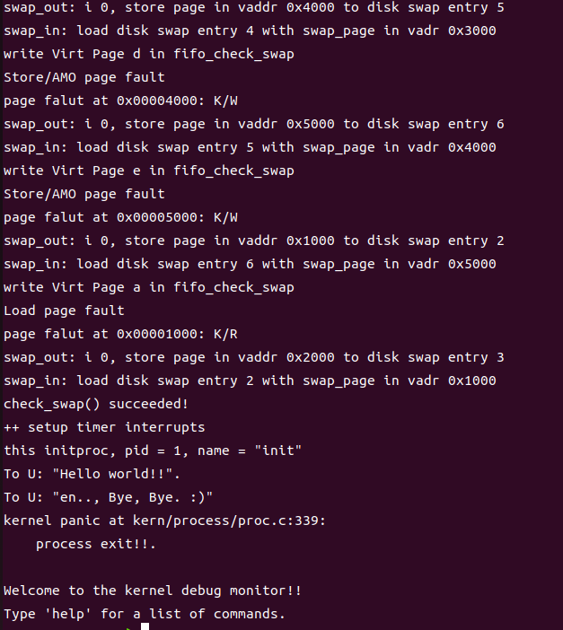
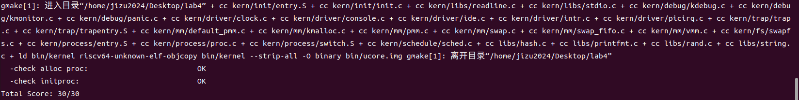

# lab4 操作系统实验报告

### 姚知言 2211290 贾景顺 2211312 李政远 2211320

### Exercise0：填写已有实验

需要在`vmm.c`中，补全lab3 exercise3给未被映射的地址映射上物理页的内容。

### Exercise1：分配并初始化一个进程控制块

>alloc_proc函数（位于kern/process/proc.c中）负责分配并返回一个新的struct proc_struct结构，用于存储新建立的内核线程的管理信息。ucore需要对这个结构进行最基本的初始化，你需要完成这个初始化过程。

在proc.h头文件中，标记了proc_struct结构体的成员，分别为
```cpp {.line-numbers}
struct proc_struct {
    enum proc_state state;                      // Process state
    int pid;                                    // Process ID
    int runs;                                   // the running times of Proces
    uintptr_t kstack;                           // Process kernel stack
    volatile bool need_resched;                 // bool value: need to be rescheduled to release CPU?
    struct proc_struct *parent;                 // the parent process
    struct mm_struct *mm;                       // Process's memory management field
    struct context context;                     // Switch here to run process
    struct trapframe *tf;                       // Trap frame for current interrupt
    uintptr_t cr3;                              // CR3 register: the base addr of Page Directroy Table(PDT)
    uint32_t flags;                             // Process flag
    char name[PROC_NAME_LEN + 1];               // Process name
    list_entry_t list_link;                     // Process link list 
    list_entry_t hash_link;                     // Process hash list
};
```
而在基本初始化过程中，我需要特别初始化三个成员，为proc->state = PROC_UNINIT;设置了进程的状态为“初始”态，这表示进程已经 “出生”了，正在获取资源茁壮成长中；
proc->pid = -1;设置了进程的pid为-1，这表示进程的“身份证号”还没有办好；
proc->cr3 = boot_cr3; 表明由于该内核线程在内核中运行，故采用为uCore内核已经建立的页表，即设置为在uCore内核页表的起始地址boot_cr3。后续实验中可进一步看出所有内核线程的内核虚地址空间（也包括物理地址空间）是相同的。既然内核线程共用一个映射内核空间的页表，这表示内核空间对所有内核线程都是“可见”的，所以更精确地说，这些内核线程都应该是从属于同一个唯一的“大内核进程”—uCore内核。
其他的则全部初始化为0即可。

>实际代码
```cpp {.line-numbers}
alloc_proc(void) 
{
    struct proc_struct *proc = kmalloc(sizeof(struct proc_struct));
    if (proc != NULL) 
    {
       
    //LAB4:EXERCISE1 YOUR CODE
    //2211320 2211312 2211290
        proc->state = PROC_UNINIT;         
        proc->pid = -1;                                
        proc->runs = 0;
        proc->kstack = (uintptr_t)0;
        proc->need_resched = 0;
        proc->parent = NULL;                 
        proc->mm = NULL;
        memset(&(proc->context), 0, sizeof(struct context));
        proc->tf = NULL;
        proc->cr3 = boot_cr3;
        proc->flags = 0; 
        memset(&(proc->name), 0, PROC_NAME_LEN + 1);
    }
    return proc;
}
```

>请在实验报告中简要说明你的设计实现过程。请回答如下问题：
请说明proc_struct中struct context context和struct trapframe *tf成员变量含义和在本实验中的作用是啥？（提示通过看代码和编程调试可以判断出来）

struct context context：储存进程当前状态，用于进程切换中上下文的保存与恢复。
struct trapframe tf：内核态中的线程返回用户态所加载的上下文，中断返回时，新进程会恢复保存的trapframe信息至各个寄存器中，然后开始执行用户代码。

### Exercise2：为新创建的内核线程分配资源

>创建一个内核线程需要分配和设置好很多资源。kernel_thread函数通过调用do_fork函数完成具体内核线程的创建工作。do_kernel函数会调用alloc_proc函数来分配并初始化一个进程控制块，但alloc_proc只是找到了一小块内存用以记录进程的必要信息，并没有实际分配这些资源。ucore一般通过do_fork实际创建新的内核线程。do_fork的作用是，创建当前内核线程的一个副本，它们的执行上下文、代码、数据都一样，但是存储位置不同。因此，我们实际需要"fork"的东西就是stack和trapframe。在这个过程中，需要给新内核线程分配资源，并且复制原进程的状态。你需要完成在kern/process/proc.c中的do_fork函数中的处理过程。它的大致执行步骤包括：
调用alloc_proc，首先获得一块用户信息块。
为进程分配一个内核栈。
复制原进程的内存管理信息到新进程（但内核线程不必做此事）
复制原进程上下文到新进程
将新进程添加到进程列表
唤醒新进程
返回新进程号


根据他的大致执行步骤给出代码
```cpp {.line-numbers}
int
do_fork(uint32_t clone_flags, uintptr_t stack, struct trapframe* tf)
{
    int ret = -E_NO_FREE_PROC;
    struct proc_struct* proc;
    if (nr_process >= MAX_PROCESS)
    {
        goto fork_out;
    }

    ret = -E_NO_MEM;
    //LAB4:EXERCISE2 YOUR CODE
    //2211320 2211312 2211290
    if ((proc = alloc_proc()) == NULL) 
    {
        goto fork_out;
    }

    if (setup_kstack(proc) != 0)
    {
        goto bad_fork_cleanup_kstack;
    }

    if (copy_mm(clone_flags, proc) != 0)
    {
        goto bad_fork_cleanup_proc;
    }

    copy_thread(proc, stack, tf);

    bool inter_flag;
    local_intr_save(inter_flag);
    {
        proc->pid = get_pid();
        hash_proc(proc);  
        list_add(&proc_list, &(proc->list_link));
    }
    local_intr_restore(inter_flag);

    wakeup_proc(proc);
  
    ret = proc->pid;

    fork_out:
        return ret;
    bad_fork_cleanup_kstack:
        put_kstack(proc);
    bad_fork_cleanup_proc:
        kfree(proc);
    goto fork_out;
}
```

>请在实验报告中简要说明你的设计实现过程。请回答如下问题：
请说明ucore是否做到给每个新fork的线程一个唯一的id？请说明你的分析和理由。

是。

`(last_pid,nextsafe]`这个区间是空闲的。
在函数get_pid中，如果静态成员last_pid小于next_safe，则当前分配的last_pid一定是安全的，即唯一的PID。
但如果last_pid大于等于next_safe，或者last_pid的值超过MAX_PID，则当前的last_pid就不一定是唯一的PID，此时就需要遍历proc_list，重新对last_pid和next_safe进行设置，为下一次的get_pid调用打下基础。
```cpp {.line-numbers}
// get_pid - alloc a unique pid for process
static int get_pid(void) {
    static_assert(MAX_PID > MAX_PROCESS);
    struct proc_struct *proc;
    list_entry_t *list = &proc_list, *le;
    static int next_safe = MAX_PID, last_pid = MAX_PID;
    if (++ last_pid >= MAX_PID) {
        last_pid = 1;
        goto inside;
    }
    if (last_pid >= next_safe) {
        inside:
            next_safe = MAX_PID;
        repeat:
            le = list;
        while ((le = list_next(le)) != list) {
            proc = le2proc(le, list_link);
            if (proc->pid == last_pid) {
                if (++ last_pid >= next_safe) {
                    if (last_pid >= MAX_PID)
                        last_pid = 1;
                    next_safe = MAX_PID;
                    goto repeat;
                }
            }
            else if (proc->pid > last_pid && next_safe > proc->pid)
                next_safe = proc->pid;
        }
    }
    return last_pid;
}
```


### Exercise3：编写proc_run 函数

>proc_run用于将指定的进程切换到CPU上运行。它的大致执行步骤包括：
检查要切换的进程是否与当前正在运行的进程相同，如果相同则不需要切换。
禁用中断。你可以使用/kern/sync/sync.h中定义好的宏local_intr_save(x)和local_intr_restore(x)来实现关、开中断。
切换当前进程为要运行的进程。
切换页表，以便使用新进程的地址空间。/libs/riscv.h中提供了lcr3(unsigned int cr3)函数，可实现修改CR3寄存器值的功能。
实现上下文切换。/kern/process中已经预先编写好了switch.S，其中定义了switch_to()函数。可实现两个进程的context切换。
允许中断。

#### 编程实现

在本函数中，包括两个进程结构体指针`proc`和`current`，表示要切换的进程和当前正在运行的进程。当两进程不同时，需要进行切换。

为保证进程切换过程不被中断打断，需要在切换开始前调用`local_intr_save()`禁用中断，在切换结束后调用`local_intr_restore()`重新启用中断。

进程切换主要逻辑如下：

1. 为保证后续调用，我们需要先定义临时变量`last`存储之前的`current`,并将`current`指向新的进程`proc`。
2. `lcr3(proc->cr3)`，以新进程的cr3，修改cr3寄存器的值，实现页表切换。
3. 调用`switch_to`函数，完成上下文切换。

实现代码如下：

proc.c
```cpp {.line-numbers}
void proc_run(struct proc_struct *proc)
{
    if (proc != current) {
        // LAB4:EXERCISE3 2211290 2211312 2211320
        /*
        * Some Useful MACROs, Functions and DEFINEs, you can use them in below implementation.
        * MACROs or Functions:
        *   local_intr_save():        Disable interrupts
        *   local_intr_restore():     Enable Interrupts
        *   lcr3():                   Modify the value of CR3 register
        *   switch_to():              Context switching between two processes
        */
        bool intr_flag;
        struct proc_struct *last = current;
        local_intr_save(intr_flag);
        current = proc;
        lcr3(proc->cr3);
        switch_to(&(last->context), &(proc->context));
        local_intr_restore(intr_flag);
    }
}
```

#### 测试结果

运行`make qemu`，能够得到正确的结果。



运行`make grade`,得到了全部的分数。



#### 问题解答

>在本实验的执行过程中，创建且运行了几个内核线程？

一共创建且运行了2个内核进程。即`idle_proc`和`init_proc`。

在kern_init中，关于进程创建和运行的函数主要包括：`proc_init`和`cpu_idle`。

在`proc_init`函数中，创建了以上两个进程，并将当前进程设置为`proc_init`。

```cpp {.line-numbers}
int kern_init(void) {
    extern char edata[], end[];
    memset(edata, 0, end - edata);

    cons_init();                // init the console

    const char *message = "(THU.CST) os is loading ...";
    cprintf("%s\n\n", message);

    print_kerninfo();

    // grade_backtrace();

    pmm_init();                 // init physical memory management

    pic_init();                 // init interrupt controller
    idt_init();                 // init interrupt descriptor table

    vmm_init();                 // init virtual memory management
    proc_init();                // init process table
    
    ide_init();                 // init ide devices
    swap_init();                // init swap

    clock_init();               // init clock interrupt
    intr_enable();              // enable irq interrupt

    cpu_idle();                 // run idle process
}
```

在`cpu_idle`中，idle进程执行cpu_idle()函数。

```cpp {.line-numbers}
void cpu_idle(void) {
    while (1) {
        if (current->need_resched) {
            schedule();
        }
    }
}
```

而在`proc_init`中，已经将current->need_resched置为1，表示该进程需要被调度，以执行其他进程的工作。

调用`schedule`后，会从进程链表中找到第一个可执行的进程，在本题中即为`init`进程。

1. idle进程：第一个内核进程，在初始化后和没有可执行进程时执行，在死循环中持续寻找是否有可执行的进程。
2. init进程：在初始化中创建的另一个进程。
   ```cpp {.line-numbers}
   int pid = kernel_thread(init_main, "Hello world!!", 0);
   ```
   通过以上函数创建，定义其执行的主函数为`init_main`，参数列表为"Hello world!"。
   在`schedule`后开始执行，完成要求的打印。
   ```cpp {.line-numbers}
   static int init_main(void *arg) {
    cprintf("this initproc, pid = %d, name = \"%s\"\n", current->pid, get_proc_name(current));
    cprintf("To U: \"%s\".\n", (const char *)arg);
    cprintf("To U: \"en.., Bye, Bye. :)\"\n");
    return 0;
   }
   ```


### Challenge：
>说明语句`local_intr_save(intr_flag);....local_intr_restore(intr_flag);`是如何实现开关中断的？

在函数`schedule()`中，实现了FIFO策略的进程调度，而为了保证进程上下文切换这一操作的原子性，则需要通过`local_intr_save(intr_flag);....local_intr_restore(intr_flag);`这一对内联函数实现中断状态的关闭、保存以及再开启，形成临界区来保证代码的正确执行。

在riscV的架构下，中断的开关状态由sstatus寄存器中的SIE位（System Interrupt Enable中断使能位）进行控制，通过读取这一字段，可以实现中断的关闭以及恢复操作。具体如下：

1.`local_intr_save(intr_flag);`——通过使用riscV的特权指令(可能是csrr)读取sstatus寄存器并将其保存到临时变量`intr_flag`中，便于后续的恢复操作，随后使用指令(可能是csrc)将 SIE 位清零，禁用中断。

2.`local_intr_restore(intr_flag);`——首先会检查临时变量`intr_flag`的bool值，如果其值为false，则说明之前中断处于关闭状态，需要重新设置SIE位将其恢复；而其值若为true，则代表中断已处于开启状态，无需进行额外操作。
