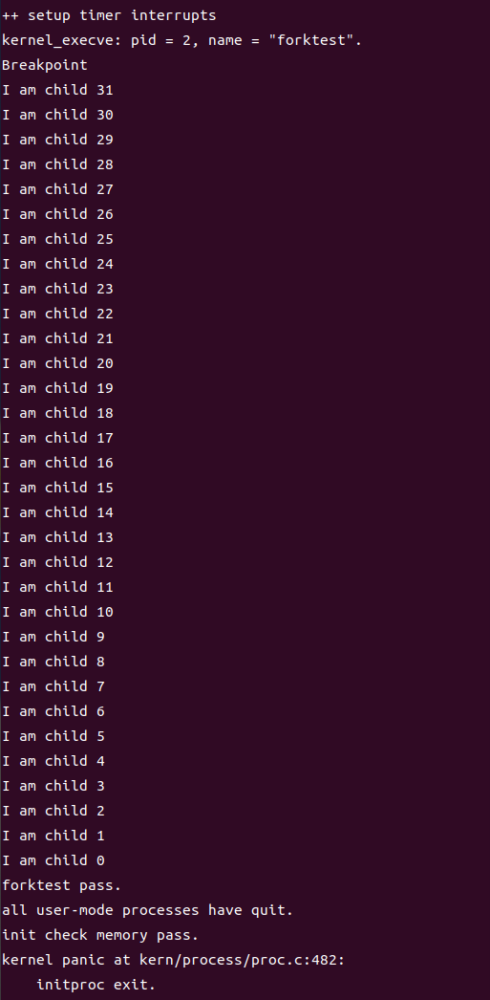
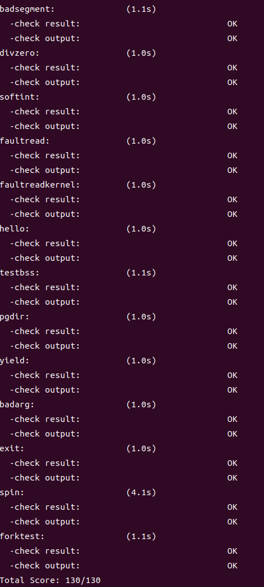

# lab3 操作系统实验报告

### 姚知言 2211290 贾景顺 2211312 李政远 2211320

### Exercise0：填写已有实验

>本实验依赖实验2/3/4。请把你做的实验2/3/4的代码填入本实验中代码中有“LAB2”/“LAB3”/“LAB4”的注释相应部分。注意：为了能够正确执行lab5的测试应用程序，可能需对已完成的实验2/3/4的代码进行进一步改进。

在代码中对应的位置填入lab2-4的代码，值得注意的是，lab4中仅有两个内核进程需要进行创建和管理，对进程结构`proc_struct`的描述比较简单，而本实验涉及对用户进程的创建、管理等一系列操作，因此对该进程结构体中的成员变量进行了完善，因此需要对lab4中的代码进行部分更新，主要体现在两个方面：

#### 1.  进程分配函数`alloc_proc`

`proc_struct`中扩展了如下部分：

```
int exit_code;                              // exit code (be sent to parent proc)
uint32_t wait_state;                        // waiting state
struct proc_struct *cptr, *yptr, *optr;     // relations between processes
```
其中`exit_code`是退出状态码，用来传递给父进程；`wait_state`来描述进程是否处于等待状态`*cptr`,`*yptr`,`*optr`分别为进程的子进程指针和兄弟进程指针，需要在进程分配时对他们进行正确初始化，代码如下：
```
proc->wait_state=0;
proc->cptr=NULL;
proc->yptr=NULL;
proc->optr=NULL;
```
在分配的初始化过程中，将等待状态`wait_state`设为0,意为为处于等待状态，同时将子进程指针和兄弟进程指针均设为空指针。

#### 2.  进程创建函数`do_fork`

同样，由于用户态进程的引入，需要新增对父进程状态以及进程间关系维护的代码，具体改动如下：

```
current->wait_state = 0;
proc->parent = current;

...

//list_add(&proc_list, &(proc->list_link)); in set_links
set_links(proc);

```
首先需要将当前进程（也就是父进程）的等待状态设为0，确保其处于可调度状态，同时将新创建进程的父进程设为当前进程。在正确设置内核栈、共享内存、上下文及中断信息等后（省略号部分），需要将新进程插入到进程链表和哈希链表中，此处与lab4相比，还需要通过`set_links`额外设置新进程与其它进程的各类关系。
### Exercise1：加载应用程序并执行

>do_execv函数调用load_icode（位于kern/process/proc.c中）来加载并解析一个处于内存中的ELF执行文件格式的应用程序。你需要补充`load_icode`的第6步，建立相应的用户内存空间来放置应用程序的代码段、数据段等，且要设置好`proc_struct`结构中的成员变量trapframe中的内容，确保在执行此进程后，能够从应用程序设定的起始执行地址开始执行。需设置正确的trapframe内容。

#### 编程实现及解释

在`load_icode`函数中完善如下代码：

```
tf->gpr.sp=USTACKTOP;
tf->epc=elf->e_entry;
tf->status= sstatus & (~SSTATUS_SPP);
tf->status= (tf->status) | SSTATUS_SPIE;
```
这一串代码实现了对进程的`trapframe`相关内容的正确设置，保证程序的中断信息与其运行的初始状态一致，并对中断寄存器的相关位进行设置，下面我们来逐行解析：

`tf->gpr.sp=USTACKTOP;`将通用寄存器中的用户栈指针指向用户栈顶。

`tf->epc=elf->e_entry;`将用户程序的入口地址设置为elf文件的入口地址。

`tf->status= sstatus & (~SSTATUS_SPP);`将中断寄存器赋值给`trapframe`结构体，并清除SPP位，表示中断完成后进入用户态。

`tf->status= (tf->status) | SSTATUS_SPIE;`将寄存器中SPIE位置1,确保中断完成后打开中断开关。

#### 问题解答

>请简要描述这个用户态进程被ucore选择占用CPU执行（RUNNING态）到具体执行应用程序第一条指令的整个经过。

在本实验中第一个用户进程是由第二个内核线程initproc通过把hello应用程序执行码覆
盖到initproc的用户虚拟内存空间来创建的，initproc线程的执行主体是`init_main`函数，不同于lab4中的
一系列`print`语句，在本实验中它会通过`kernal_thread`函数，将程序执行流跳转到`user_main`，在缺省时执行宏KERNEL_EXECVE(hello)。
由于ld在链接hello应用程序执行码时定义了两全局变量：
_binary_obj___user_hello_out_start：hello执行码的起始位置；
_binary_obj___user_hello_out_size中：hello执行码的大小，
这两个参数随着宏最终调用`kernel_execve`函数，通过内联汇编，一并被传入到`SYS_exec`进行系统调用，当ucore收到此系统调用后，会执行一系列函数并最终调用`load_icode`函数，其主要工作就是给用户进程建立一个能够让用户进程正常运行的用户环境。
至此，用户进程的用户环境已经搭建完毕。此时initproc将按产生系统调用的函数调用路径原路返回.此时并不会直接开始执行刚刚建立完成的用户进程，而是继续执行`init_main`函数，在`while (do_wait(0, NULL) == 0) {schedule();}`中利用`do_wait`根据 pid 来查找子进程，如果找到了子进程`haskid == 1`，并且该子进程没有处于 `PROC_ZOMBIE` 状态，父进程将进入睡眠状态`PROC_SLEEPING`，并设置 `wait_state` 为 `WT_CHILD`，表示父进程正在等待子进程退出,同时在`schedule`中调度可运行的进程开始执行，即用户态进程开始正式执行。

### Exercise2：父进程复制自己的内存空间给子进程

>创建子进程的函数do_fork在执行中将拷贝当前进程（即父进程）的用户内存地址空间中的合法内容到新进程中（子进程），完成内存资源的复制。具体是通过copy_range函数（位于kern/mm/pmm.c中）实现的，请补充copy_range的实现，确保能够正确执行。

#### 编程实现及解释
在`copy_range`中补充代码如下

```
void *src_kvaddr = page2kva(page);
void *dst_kvaddr = page2kva(npage);
memcpy(dst_kvaddr, src_kvaddr, PGSIZE);
ret = page_insert(to, npage, start, perm);
```

上面四行代码中前两行通过`page2kva`函数分别获取源进程页和目标进程页的内核虚拟地址，随后通过`memcpy`函数，按照字符串逐字符复制，将源进程页的内核虚拟地址复制过去，以此来实现内容的复制。成功复制后，调用`page_insert`函数建立新复制过来的页的物理地址与虚拟地址`start`的页表项映射关系，其中传递的权限参数`perm`与源进程中的用户权限位一致。由于后面需要确保`ret=0`,以确定映射被正确建立，因此我们需要将`page_insert`的返回值赋值给ret。`page_insert`的函数定义如下：

```
int page_insert(pde_t *pgdir, struct Page *page, uintptr_t la, uint32_t perm) {
    pte_t *ptep = get_pte(pgdir, la, 1);
    if (ptep == NULL) {
        return -E_NO_MEM;
    }
    page_ref_inc(page);
    if (*ptep & PTE_V) {
        struct Page *p = pte2page(*ptep);
        if (p == page) {
            page_ref_dec(page);
        } else {
            page_remove_pte(pgdir, la, ptep);
        }
    }
    *ptep = pte_create(page2ppn(page), PTE_V | perm);
    tlb_invalidate(pgdir, la);
    return 0;
```

在该函数中，首先会找到虚拟地址的页表项`ptep`,并判定是否已经和将要建立映射的页建立了对应的映射关系。随后通过`pte_create`创建新的页表项，并将物理页号和权限信息写入。可以看到若是以上操作成功完成，函数将返回0，否则将返回错误代码。

#### 测试结果
运行`make qemu`以及`make grade`,均能得到正确的结果，如下图所示：





#### 问题解答

>如何设计实现Copy on Write机制？给出概要设计，鼓励给出详细设计。
Copy-on-write（简称COW）的基本概念是指如果有多个使用者对一个资源A（比如内存块）进行读操作，则每个使用者只需获得一个指向同一个资源A的指针，就可以该资源了。若某使用者需要对这个资源A进行写操作，系统会对该资源进行拷贝操作，从而使得该“写操作”使用者获得一个该资源A的“私有”拷贝—资源B，可对资源B进行写操作。该“写操作”使用者对资源B的改变对于其他的使用者而言是不可见的，因为其他使用者看到的还是资源A。

详情请见Challenge1。

### Exercise3：阅读分析源代码，理解进程执行 `fork/exec/wait/exit` 的实现，以及系统调用的实现

>请在实验报告中简要说明你对 fork/exec/wait/exit函数的分析。并回答如下问题：
请分析fork/exec/wait/exit的执行流程。重点关注哪些操作是在用户态完成，哪些是在内核态完成？内核态与用户态程序是如何交错执行的？内核态执行结果是如何返回给用户程序的？

fork,exec,wait和exit中封装了系统调用函数，这四个函数操作都是在用户态完成的，而当用户态程序触发ebreak或者ecall中断时，会触发trap从而进入内核态，从而发起syscall系统调用，然后会对系统调用的函数进行分发，然后调用sys_fork等内核态运行的操作。  

对于syscall的调用，在tf的a0寄存器寄存了它的系统调用编号，然后它把寄存器里的参数取出来，转发给系统调用编号对应的函数进行处理。  

fork是用户态的一个接口函数，他在ulib.c中实现，具体为调用了sys_fork()，而sys_fork()在syscall.c中被调用，此时为调用syscall(SYS_fork)，而通过SYS_fork的编号，调用do_fork(0, stack, tf)，最终导向了do_fork()函数，创建并初始化了一个新的PCB，初始化一个新的PID，并且设置新的进程状态为UNINIT。实际上是在用户态通过使用系统调用运行内核态的过程。  

wait跟fork同理，也是用户态的一个接口函数，在ulib.c中实现，具体为调用了sys_wait(0, NULL)，而sys_wait(0, NULL)在syscall.c中被调用，此时为调用syscall(SYS_wait)，而通过SYS_wait的编号，调用do_wait(pid, store)，最终导向了do_wait()函数,而do_wait()函数为，当前进程若无子进程,则返回错误;若有子进程,则判定是否为 ZOMBIE 子进程,有则释放子进程的资源,并返回子进程的返回状态码; 若无 ZOMBIE 状态子进程, 则进入 SLEEPING 状态,等子进程唤醒。

exec的形式直接为sys_exec(),封装了do_execve(name, len, binary, size)，作用为调用exit_mmap(mm)&put_pgdir(mm)清除了当前进程的内存布局，再通过调用load_icode，读取ELF映像中的内存布局并且填写，保持进程状态不变，

exit 为清除当前进程几乎所有资源(PCB和内核栈不清除), 将所有子进程(如果有的话)设置为 init 进程(内核), 将当前进程状态设置为 ZOMBIE; 若有父进程在等待当前进程。

具体来说，用户态调用fork等函数，并触发trap进入内核态，根据寄存器参数分发相应的函数指针，触发系统调用的相关函数，类似于sys_exit等，调用完成后内核态通过sret返回用户态，实现交错执行.  

在这些系统调用的执行流程中，用户态和内核态之间的切换是关键的。当用户程序执行系统调用时，会触发从用户态切换到内核态，让操作系统执行相关的内核代码。在系统调用完成后，操作系统会将控制权切回到用户态，让用户程序继续执行。  

>请给出ucore中一个用户态进程的执行状态生命周期图（包执行状态，执行状态之间的变换关系，以及产生变换的事件或函数调用）。（字符方式画即可） 
 
```cpp {.line-numbers}
                                                      ↑ ↑--------->|  |
                                                      | |          ↓  ↓ 
init_main()--> kernel_thread() -->PROC_UNINIT --wakeup_proc()--> RUNNABLE --> exit() --> PROC_ZOMBIE
                                                      | |           |  |                   ↑ ↑
                                                      | |           ↓  ↓                   | |
                                                      | |         do_wait()                | |
                                                      | |           |  |                   ↑ ↑
                                                      ↑ ↑           ↓  ↓                   | |
                                                  pid != 0 <--PROC_SLEEPING --> exit() --> | |
```

### Chellenge1：实现 Copy on Write （COW）机制

>给出实现源码,测试用例和设计报告（包括在cow情况下的各种状态转换（类似有限状态自动机）的说明）。
这个扩展练习涉及到本实验和上一个实验“虚拟内存管理”。在ucore操作系统中，当一个用户父进程创建自己的子进程时，父进程会把其申请的用户空间设置为只读，子进程可共享父进程占用的用户内存空间中的页面（这就是一个共享的资源）。当其中任何一个进程修改此用户内存空间中的某页面时，ucore会通过page fault异常获知该操作，并完成拷贝内存页面，使得两个进程都有各自的内存页面。这样一个进程所做的修改不会被另外一个进程可见了。请在ucore中实现这样的COW机制。
由于COW实现比较复杂，容易引入bug，请参考 https://dirtycow.ninja/ 看看能否在ucore的COW实现中模拟这个错误和解决方案。需要有解释。

  注：COW的实现较为复杂，且UCORE中存在较多已经设计但并未完全完成的功能。在本次实验中，并没能完成完整的COW设计。将探索过程中的思想与实现展示如下。
  
COW机制的核心主要分为两个部分：

1. 在父进程向子进程共享同一页面时，不再拷贝内存，而是直接把两个指针指向同一片内存。

2. 当任一进程想要写入共享的内存时，为他分配一个新页，然后进行拷贝。

而原本在 Exercise 2 中的做法则是直接进行拷贝，这样是非常稳妥的，但是却不利于空间的节省。

#### 共享内存

首先需要修改的就是`copy_range`函数，这一部分的实现应该没有什么问题。

由于在 Exercise 2 中已经进行了较为详细的分析，这里主要对修改部分进行说明。

```cpp {.line-numbers}
int copy_range(pde_t *to, pde_t *from, uintptr_t start, uintptr_t end,
               bool share) {
            
            ...

            int ret = 0;
            bool use_cow = 1;

            if(use_cow){
                perm |= PTE_USER_SHARE;
                page_insert(to, page, start, perm);
                ret = page_insert(to, page, start, perm);
            }
            else{
                // alloc a page for process B
                struct Page *npage = alloc_page();
                assert(page != NULL);
                assert(npage != NULL);

                //EX2 begin
                void *src_kvaddr = page2kva(page);
                void *dst_kvaddr = page2kva(npage);
                memcpy(dst_kvaddr, src_kvaddr, PGSIZE);
                ret = page_insert(to, npage, start, perm);
            }
            assert(ret == 0);
        }
        start += PGSIZE;
    } while (start != 0 && start < end);
    return 0;
}
```

在设计中，我定义了`use_cow`标记，是用来切换是否开启COW的，若不开启的时候我保留了

对于使用COW的实现：

1. 为perm设置标记位，`PTE_USER_SHARE`是我重新设计的标记位，与`PTE_USER`的区别是多了`SHARE`位，但是少了`W`位。用于标记这个页面是共享的，且是不可以写入的。
   
为此，我修改了标记位的对应关系，增加了SHARE位，由于标记位数量有限，我将之前保留给软件的SOFT位从0x300（两位）改为0x100（一位）。

```cpp {.line-numbers}
// page table entry (PTE) fields

...

#define PTE_SOFT  0x100 // Reserved for Software
#define PTE_SHARE 0x200 // Share new!!

#define PAGE_TABLE_DIR (PTE_V)
#define READ_ONLY (PTE_R | PTE_V)
#define READ_WRITE (PTE_R | PTE_W | PTE_V)
#define EXEC_ONLY (PTE_X | PTE_V)
#define READ_EXEC (PTE_R | PTE_X | PTE_V)
#define READ_WRITE_EXEC (PTE_R | PTE_W | PTE_X | PTE_V)

#define PTE_USER (PTE_R | PTE_W | PTE_X | PTE_U | PTE_V)

//new!!
#define PTE_USER_SHARE (PTE_R | PTE_X | PTE_U | PTE_V | PTE_SHARE)
```
2. 通过`page_insert`函数为两个线程中的page创建页表项。

为什么可以这么做？

在 Exercise 2 中可以发现，即使对相同页面（或者不同页面）进行重复映射，在函数执行过程中仍然可以通过删除之前的映射，并更新计数器，以保证这样的调用并不存在问题。

当然，在这一步操作中有一个令人疑惑的地方，就是`pte_create`本质上是一个移位拼接晕死案，在`page_insert`却没有对返回值进行保存或者进一步调用。考虑这可能是一个尚未完全实现的功能。

```cpp {.line-numbers}
static inline pte_t pte_create(uintptr_t ppn, int type) {
  return (ppn << PTE_PPN_SHIFT) | PTE_V | type;
}
```

#### 写入时分配

这里的设计是想要在程序想要写入一个不可写的页面时，让他去触发一个中断，从而在中断中完成分配操作。

因此，我们需要修改`do_pgfault`缺页异常的逻辑。

以下是设计的代码：

```cpp {.line-numbers}
int do_pgfault(struct mm_struct *mm, uint_t error_code, uintptr_t addr) {
    ...
    if (*ptep == 0) { 
        ...//原有分支，物理页面不存在的分配
    } 
    else if((error_code & 1) && (error_code & 2) && (*ptep & PTE_SHARE) && (*ptep &PTE_V)){
        struct Page *npage = alloc_page();
        void *src_kvaddr = page2kva(pte2page(*ptep));
        void *dst_kvaddr = page2kva(npage);
        (*ptep)=((*ptep) & (~PTE_SHARE))|PTE_W;
        memcpy(dst_kvaddr, src_kvaddr, PGSIZE);
        page_ref_inc(pte2page(*ptep));
        pte_create(page2ppn(pte2page(*ptep)), PTE_V | perm);
    }
    else {
        ...//同lab3 ex3 正常的换页逻辑
    }
    ret = 0;
failed:
    return ret;
}
```

设计并不难理解，主要想法其实还是像 Exercise 2 一样，分配一个新页，并且进行拷贝和建立映射关系。

对于判定的设定问题：判定是error_code的后两位是1，且这个页面是共享的和有效的。

```cpp {.line-numbers}
 *         -- The P flag   (bit 0) indicates whether the exception was due to a not-present page (0)
 *            or to either an access rights violation or the use of a reserved bit (1).
 *         -- The W/R flag (bit 1) indicates whether the memory access that caused the exception
 *            was a read (0) or write (1).
 *         -- The U/S flag (bit 2) indicates whether the processor was executing at user mode (1)
 *            or supervisor mode (0) at the time of the exception.
```

以上是ucore在`do_pgfault`对error_code的说明。

第一位为1说明了异常是由一个存在的页触发的。

第二位为1说明异常是由写入触发的。

同时：页面是共享的，有效的。

其实这样看来，已经可以比较好的捕获我们想要捕获的目标异常。

对于标记位的设定：重新分配的复制而来的页面，将是不共享的，且可写的，这也是我在函数中设计的理念。

#### 总结

这样的设计没能通过验证，说明其中仍然存在一些问题。这些问题可能由于ucore中一些设计但未能实现，需要我去补充的模块导致，也可能是我在编写过程中留下了一些错误。考虑到期末时间较为紧张，无法在进行进一步探索。

### Chellenge2：说明该用户程序是何时被预先加载到内存中的？与我们常用操作系统的加载有何区别，原因是什么？

用户程序在编译的时候链接到内核中。以下是Makefile中，编译链接用户程序的指令。

```cpp {.line-numbers}
UINCLUDE	+= user/include/ \
			   user/libs/

USRCDIR		+= user

ULIBDIR		+= user/libs

UCFLAGS		+= $(addprefix -I,$(UINCLUDE))
USER_BINS	:=

$(call add_files_cc,$(call listf_cc,$(ULIBDIR)),ulibs,$(UCFLAGS))
$(call add_files_cc,$(call listf_cc,$(USRCDIR)),uprog,$(UCFLAGS))

UOBJS	:= $(call read_packet,ulibs libs)

define uprog_ld
__user_bin__ := $$(call ubinfile,$(1))
USER_BINS += $$(__user_bin__)
$$(__user_bin__): tools/user.ld
$$(__user_bin__): $$(UOBJS)
$$(__user_bin__): $(1) | $$$$(dir $$$$@)
	$(V)$(LD) $(LDFLAGS) -T tools/user.ld -o $$@ $$(UOBJS) $(1)
	@$(OBJDUMP) -S $$@ > $$(call cgtype,$$<,o,asm)
	@$(OBJDUMP) -t $$@ | sed '1,/SYMBOL TABLE/d; s/ .* / /; /^$$$$/d' > $$(call cgtype,$$<,o,sym)
endef

$(foreach p,$(call read_packet,uprog),$(eval $(call uprog_ld,$(p))))
```

然后再在`user_main`函数中，通过`KERNEL_EXECVE`宏调用`kernel_execve("exit", _binary_obj___user_exit_out_start,_binary_obj___user_exit_out_size)`。

```cpp {.line-numbers}
static int user_main(void *arg) {
#ifdef TEST
    KERNEL_EXECVE2(TEST, TESTSTART, TESTSIZE);
#else
    KERNEL_EXECVE(exit);
#endif
    panic("user_main execve failed.\n");
}
```

在`kernel_execve`中，通过内联汇编的形式，触发中断从而调用`do_execve`函数。

```cpp {.line-numbers}
static int kernel_execve(const char *name, unsigned char *binary, size_t size) {
    int64_t ret=0, len = strlen(name);
    asm volatile(
        "li a0, %1\n"
        "lw a1, %2\n"
        "lw a2, %3\n"
        "lw a3, %4\n"
        "lw a4, %5\n"
        "li a7, 10\n"
        "ebreak\n"
        "sw a0, %0\n"
        : "=m"(ret)
        : "i"(SYS_exec), "m"(name), "m"(len), "m"(binary), "m"(size)
        : "memory"); 
    cprintf("ret = %d\n", ret);
    return ret;
}
```

`do_execve`函数实现的功能是将当前进程已经占用的内存释放，将新的程序加载到当前进程（在`load_icode`完成），以便在当前进程中执行用户程序。也就是说，程序是在`load_icode`调用中被加载到内存中的。

```cpp {.line-numbers}
int do_execve(const char *name, size_t len, unsigned char *binary, size_t size) {
    struct mm_struct *mm = current->mm;
    if (!user_mem_check(mm, (uintptr_t)name, len, 0)) {
        return -E_INVAL;
    }
    if (len > PROC_NAME_LEN) {
        len = PROC_NAME_LEN;
    }

    char local_name[PROC_NAME_LEN + 1];
    memset(local_name, 0, sizeof(local_name));
    memcpy(local_name, name, len);

    if (mm != NULL) {
        cputs("mm != NULL");
        lcr3(boot_cr3);
        if (mm_count_dec(mm) == 0) {
            exit_mmap(mm);
            put_pgdir(mm);
            mm_destroy(mm);
        }
        current->mm = NULL;
    }
    int ret;
    if ((ret = load_icode(binary, size)) != 0) {
        goto execve_exit;
    }
    set_proc_name(current, local_name);
    return 0;

execve_exit:
    do_exit(ret);
    panic("already exit: %e.\n", ret);
}
```

在常用操作系统中，用户程序一般是一个在内存中独立存在的程序。在程序需要被执行时，加载器负责将可执行文件（如 .exe 或 .out 文件）从硬盘或其他存储设备加载到内存中，并开始程序的执行。

此外，由于有些用户程序过大，操作系统可能不必将整个程序加载到内存中，同时可以通过动态内存换入换出提升性能。

产生区别的原因是我们用来测试的文件大小很小，没有必要再进行动态换入换出。此外，ucore没有实现文件系统，这样做的实现较为简单。